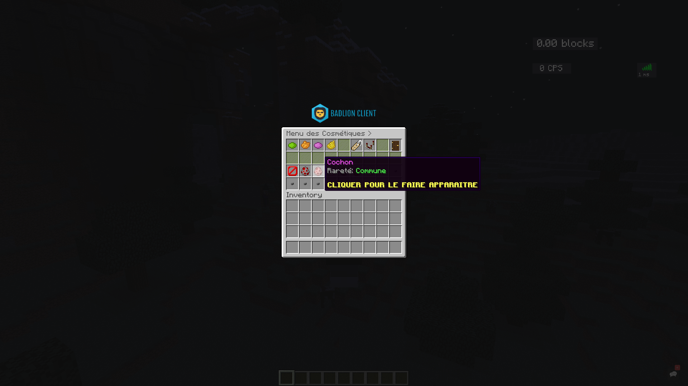
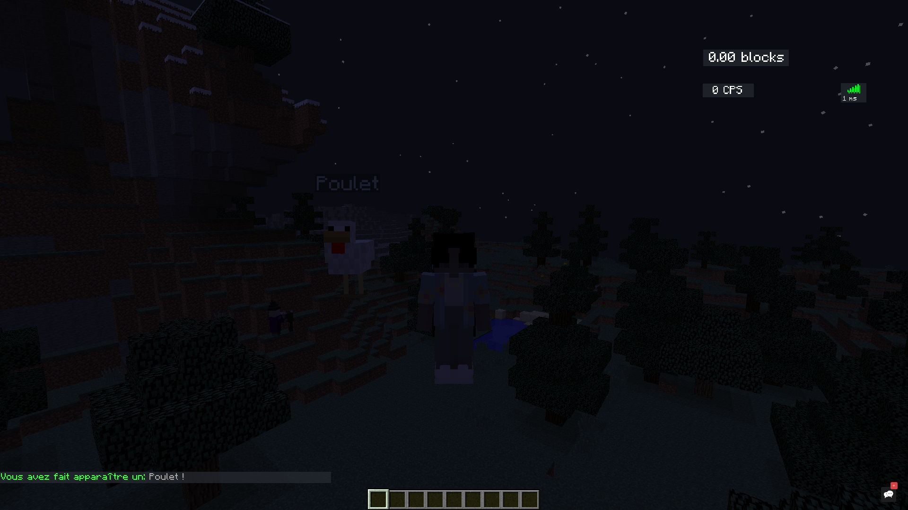

# AmazingPet
This repository is a minecraft plugin which required Spigot to be used.
You can use it from **1.8** to the **latest minecraft version**. This
plugin enables you to spawn pet we created, those pets are ranked by
three categories: __COMMON__, __RARE__, __EPIC__ and finally __LEGENDARY__. 

## Preview

## Configuration
You can also configure messages in the file created in the following directory:
**plugins/AmazingPet/config.yml**, you will be able to modify messages and translate them
and others things.

## API
We developped an API to let you modify easier and faster our plugin!
You can easily find it by [CLICKING HERE](https://github.com/Pseudow/AmazingPetAPI).

# License
  This project is a simple Spigot plugin which allows you to create pet and other things in a Spigot Minecraft Server.
  Copyright (C) 2020 AmazingPet

  This program is free software; you can redistribute it and/or modify
  it under the terms of the GNU General Public License as published by
  the Free Software Foundation; either version 2 of the License, or
  (at your option) any later version.

  This program is distributed in the hope that it will be useful,
  but WITHOUT ANY WARRANTY; without even the implied warranty of
  MERCHANTABILITY or FITNESS FOR A PARTICULAR PURPOSE.  See the
  GNU General Public License for more details.

  You should have received a copy of the GNU General Public License along
  with this program; if not, write to the Free Software Foundation, Inc.,
  51 Franklin Street, Fifth Floor, Boston, MA 02110-1301 USA.

# Credits
Developped by: **Pseudow** and **Swiiz**.
